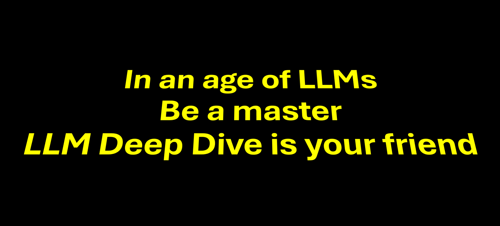

  
  <h1>The LLM Deep Dive</h1>
  

    🐦 <a href="https://twitter.com/charoori_ai">Follow me on Twitter</a> •
    📧 <a href="mailto:chandrahas.aroori@gmail.com?subject=LLM%20Cookbook">Contact on Email</a>
  

 

In an age of GPT, I'm going to handwrite the best links I've used to learn LLMs.
Welcome.

PS: This is for people trying to go deeper. If you want something kind of basic, look elsewhere.