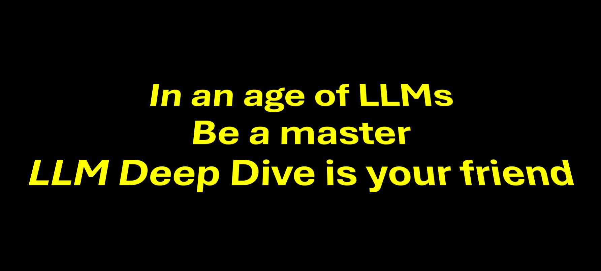

  
  <h1>The LLM Deep Dive</h1>
  

    🐦 <a href="https://twitter.com/charoori_ai">Follow me on Twitter</a> •
    📧 <a href="mailto:chandrahas.aroori@gmail.com?subject=LLM%20Cookbook">Contact on Email</a>
  

 

In an age of GPT, I'm going to handwrite the best links I've used to learn LLMs.

**Welcome.**

PS: This is for people trying to go deeper. If you want something kind of basic, look elsewhere.

#### ◻️How to use this guide?
Start by going through the Table of contents. See what you've already read and what you haven't.
Then, start with Easy links in each section. 
Each area has multiple types of subtopics each of which will go more in depth. In the event there are no articles, feel free to email for additions or raise a PR.

#### ◻️Table of contents
- [🟩 Model Architecture](#-model-architecture)
  - [◻️Transformer Architecture](#️transformer-architecture)
    - [Tokenization](#tokenization)
    - [Positional Encoding](#positional-encoding)
      - [Rotational Positional Encoding](#rotational-positional-encoding)
      - [Rotary Positional Encoding](#rotary-positional-encoding)
  - [◻️GPT Architecture](#️gpt-architecture)
  - [◻️Attention](#️attention)
  - [◻️Loss](#️loss)
    - [Cross-Entropy Loss](#cross-entropy-loss)
- [🟩 Agentic LLMs](#-agentic-llms)
- [🟩 Methodology](#-methodology)
  - [◻️Distillation](#️distillation)
- [🟩 Datasets](#-datasets)
- [🟩 Pipeline](#-pipeline)
  - [◻️Training](#️training)
  - [◻️Inference](#️inference)
    - [RAG](#rag)
  - [◻️Prompting](#️prompting)
- [🟩 FineTuning](#-finetuning)
  - [◻️Quantized FineTuning](#️quantized-finetuning)
  - [◻️LoRA](#️lora)
  - [◻️DPO](#️dpo)
  - [◻️ORPO](#️orpo)
  - [◻️RLHF](#️rlhf)
- [🟩 Quantization](#-quantization)
  - [◻️Post Training Quantization](#️post-training-quantization)
    - [Static/Dynamic Quantization](#staticdynamic-quantization)
    - [GPTQ](#gptq)
    - [GGUF](#gguf)
    - [LLM.int8()](#llmint8)
  - [◻️Quantization Aware Training → 1BIT LLM](#️quantization-aware-training--1bit-llm)
- [🟩 RL in LLM](#-rl-in-llm)
- [🟩 Coding](#-coding)
  - [◻️Torch Fundamentals](#️torch-fundamentals)
- [🟩 Deployment](#-deployment)
- [🟩 Engineering](#-engineering)
  - [◻️Flash Attention 2](#️flash-attention-2)
  - [◻️KV Cache](#️kv-cache)
  - [◻️Batched Inference](#️batched-inference)
  - [◻️Python Advanced](#️python-advanced)
    - [Decorators](#decorators)
    - [Context Managers](#context-managers)
  - [◻️Triton Kernels](#️triton-kernels)
  - [◻️CuDA](#️cuda)
  - [◻️JAX / XLA JIT compilers](#️jax--xla-jit-compilers)
  - [◻️Model Exporting (vLLM, Llama.cpp, QLoRA)](#️model-exporting-vllm-llamacpp-qlora)
  - [◻️ML Debugging](#️ml-debugging)
- [🟩 Benchmarks](#-benchmarks)
- [🟩 Modifications](#-modifications)
  - [◻️Model Merging](#️model-merging)
    - [Linear Mapping](#linear-mapping)
    - [SLERP](#slerp)
    - [TIES](#ties)
    - [DARE](#dare)
  - [◻️MoE](#️moe)
- [🟩 Misc Algorithms](#-misc-algorithms)
  - [◻️Chained Matrix Unit](#️chained-matrix-unit)
  - [◻️Gradient Checkpointing](#️gradient-checkpointing)
  - [◻️Chunked Cross Entropy](#️chunked-cross-entropy)
  - [◻️BPE](#️bpe)
- [🟩 Explainability](#-explainability)
  - [◻️Sparse Autoencoders](#️sparse-autoencoders)
  - [◻️Task Vectors](#️task-vectors)
  - [◻️Counterfactuals](#️counterfactuals)
- [🟩 MultiModal Transformers](#-multimodal-transformers)
  - [◻️Audio](#️audio)
    - [Whisper Models](#whisper-models)
    - [Diarization](#diarization)
- [🟩 Adversarial methods](#-adversarial-methods)
- [🟩 Misc](#-misc)
- [🟩 Add to the guide:](#-add-to-the-guide)

### 🟩 Model Architecture
This section talks about the key aspects of LLM architecture.
> 📝 Try to cover basics of Transformers, then understand the GPT architecture before diving deeper into other concepts
#### ◻️Transformer Architecture
- [Jay Alamar - Illustrated Transformer](https://jalammar.github.io/illustrated-transformer/) 
- [Umar Jamil: Attention](https://www.youtube.com/watch?v=bCz4OMemCcA&) 

##### Tokenization
- [Tokenization in large language models, explained](https://seantrott.substack.com/p/tokenization-in-large-language-models)
##### Positional Encoding
###### Rotational Positional Encoding
###### Rotary Positional Encoding
-[Rotary Positional Encoding Explained](https://medium.com/@ngiengkianyew/understanding-rotary-positional-encoding-40635a4d078e)

#### ◻️GPT Architecture
- [Jay Alamar - Illustrated GPT2](https://jalammar.github.io/illustrated-gpt2/) 
- [Reproducing GPT-2 (124M) in llm.c in 90 minutes for $20](https://github.com/karpathy/llm.c/discussions/481) 
- [Umar Jamil: Llama Explained](https://www.youtube.com/watch?v=Mn_9W1nCFLo) 
- [Umar Jamil: Llama 2 from Scratch](https://www.youtube.com/watch?v=oM4VmoabDAI) 

#### ◻️Attention

#### ◻️Loss
##### Cross-Entropy Loss
- [Cross Entropy in Large Language Models (LLMs)](https://medium.com/ai-assimilating-intelligence/cross-entropy-in-large-language-models-llms-4f1c842b5fca)
---
### 🟩 Agentic LLMs
-[Agentic LLMs Deep Dive](https://www.aimon.ai/posts/deep-dive-into-agentic-llm-frameworks)
This section talks about various aspects of the Agentic LLMs

---
### 🟩 Methodology
This section tries to cover various methodologies used in LLMs. 
#### ◻️Distillation
- [LLM distillation demystified: a complete guide](https://snorkel.ai/blog/llm-distillation-demystified-a-complete-guide/)
---
### 🟩 Datasets

---
### 🟩 Pipeline
#### ◻️Training
#### ◻️Inference
##### RAG
#### ◻️Prompting

---
### 🟩 FineTuning
#### ◻️Quantized FineTuning
- [Umar Jamil: Quantization](https://www.youtube.com/watch?v=0VdNflU08yA) 
#### ◻️LoRA
- [Umar Jamil: LoRA Explained](https://www.youtube.com/watch?v=PXWYUTMt-AU) 
#### ◻️DPO
- [Umar Jamil: DPO Explained](https://www.youtube.com/watch?v=hvGa5Mba4c8) 
#### ◻️ORPO
#### ◻️RLHF
- [Umar Jamil: RLHF Explained](https://www.youtube.com/watch?v=qGyFrqc34yc) 

---
### 🟩 Quantization
#### ◻️Post Training Quantization
##### Static/Dynamic Quantization
##### GPTQ
##### GGUF
##### LLM.int8()
#### ◻️Quantization Aware Training → 1BIT LLM

---
### 🟩 RL in LLM

---
### 🟩 Coding
#### ◻️Torch Fundamentals

---
### 🟩 Deployment
- [How continuous batching enables 23x throughput in LLM inference while reducing p50 latency](https://www.anyscale.com/blog/continuous-batching-llm-inference)
- [LLM Inference Optimizations — Continuous Batching and Selective Batching, Orca](https://medium.com/byte-sized-ai/inference-optimizations-1-continuous-batching-03408c673098)
- [[vLLM] LLM Inference Optimizations: Chunked Prefill and Decode-Maximal Batching](https://medium.com/byte-sized-ai/llm-inference-optimizations-2-chunked-prefill-764407b3a67a)
- [LLM Inference Series: 2. The two-phase process behind LLMs’ responses](https://medium.com/@plienhar/llm-inference-series-2-the-two-phase-process-behind-llms-responses-1ff1ff021cd5)
- [LLM Inference Series: 4. KV caching, a deeper look](https://medium.com/@plienhar/llm-inference-series-4-kv-caching-a-deeper-look-4ba9a77746c8)

---
### 🟩 Engineering
- [ML Engineering; Used for training BLOOM](https://github.com/stas00/ml-engineering/tree/master) 

- [Low Level Technicals of LLMs](https://www.youtube.com/watch?v=pRM_P6UfdIc) 
- [Fixing bugs in Llama, Mistral, Gemma](https://www.youtube.com/watch?v=TKmfBnW0mQA) 
- [PyTorch Conference Mini Talk](https://www.youtube.com/watch?v=PdtKkc5jB4g) 
- [PyTorch Engineers Meeting Talk](https://www.youtube.com/watch?v=MQwryfkydc0) 
- [Hugging Face Collab Blog](https://huggingface.co/blog/unsloth-trl) 
#### ◻️Flash Attention 2
#### ◻️KV Cache
#### ◻️Batched Inference
#### ◻️Python Advanced
##### Decorators
##### Context Managers
#### ◻️Triton Kernels
#### ◻️CuDA
- [CUDA / GPU Mode lecture Talk](https://www.youtube.com/watch?v=hfb_AIhDYnA) 
#### ◻️JAX / XLA JIT compilers
#### ◻️Model Exporting (vLLM, Llama.cpp, QLoRA)
#### ◻️ML Debugging

---
### 🟩 Benchmarks

---
### 🟩 Modifications
#### ◻️Model Merging
-[An Introduction to Model Merging for LLMs](https://developer.nvidia.com/blog/an-introduction-to-model-merging-for-llms/)
##### Linear Mapping
##### SLERP
-[Merging tokens to accelerate LLM inference with SLERP](https://medium.com/towards-data-science/merging-tokens-to-accelerate-llm-inference-with-slerp-38a32bf7f194)
##### TIES
##### DARE
#### ◻️MoE

---
### 🟩 Misc Algorithms
#### ◻️Chained Matrix Unit
#### ◻️Gradient Checkpointing
#### ◻️Chunked Cross Entropy
#### ◻️BPE

---
### 🟩 Explainability
#### ◻️Sparse Autoencoders
- [Sparse AutoEncoders Explained](https://adamkarvonen.github.io/machine_learning/2024/06/11/sae-intuitions.html) 
#### ◻️Task Vectors
#### ◻️Counterfactuals

---
### 🟩 MultiModal Transformers
#### ◻️Audio
##### Whisper Models
- [Whisper Model Explained](https://www.notta.ai/en/blog/how-to-use-whisper)
##### Diarization

---
### 🟩 Adversarial methods

---

### 🟩 Misc
- [Tweet on what to learn in ML (RT by Karpathy)](https://x.com/youraimarketer/status/1778992208697258152) 
---

### 🟩 Add to the guide:
Add links you find useful through pull requests. 
<!-- Use the following code for sample links:
- [Link 1](http://example.com) 
- [Link 2](http://example.com) 
- [Link 3](http://example.com)  -->
